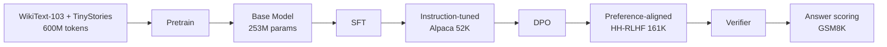

# Modern LLM

A from-scratch implementation of a **frontier-style LLM training pipeline**, demonstrating modern architectural choices and a complete alignment workflow. This project achieves impressive results with a 253M parameter model that **outperforms GPT-2 by 33%** on perplexity benchmarks.

## What is Modern LLM?

Modern LLM is a comprehensive, production-ready implementation of a language model training pipeline that showcases:

- **Modern architecture** - RoPE, RMSNorm, SwiGLU, and attention sinks
- **Complete alignment pipeline** - Pretrain → SFT → DPO → Verifier
- **Research-grounded code** - Every component includes paper references and mathematical documentation
- **Practical performance** - Achieves 27.03 perplexity on WikiText-2, significantly beating GPT-2's 40.64

<CardGroup cols={2}>
  <Card title="Quick Start" icon="rocket" href="/quickstart">
    Get up and running in 5 minutes with a smoke test, then explore pre-trained checkpoints
  </Card>
  <Card title="Installation" icon="download" href="/installation">
    Complete installation guide with environment setup and dependency management
  </Card>
  <Card title="Architecture" icon="microchip" href="/architecture">
    Deep dive into the model architecture with RoPE, RMSNorm, SwiGLU, and attention sinks
  </Card>
  <Card title="Training Pipeline" icon="diagram-project" href="/training">
    Learn about the complete training workflow from pretraining to alignment
  </Card>
</CardGroup>

## Performance results

Our 253M parameter model demonstrates strong performance across key metrics:

### Perplexity on WikiText-2

| Model | Parameters | Perplexity | vs GPT-2 |
|-------|------------|------------|----------|
| GPT-2 (baseline) | 124M | 40.64 | — |
| **Modern LLM (pretrain)** | **253M** | **27.03** | **-33%** |
| Modern LLM (SFT) | 253M | 34.14 | -16% |
| Modern LLM (DPO) | 253M | 34.32 | -16% |

<Note>
  Lower perplexity is better. The pretrained model achieves the best perplexity score, while SFT and DPO models are optimized for instruction-following and preference alignment rather than raw language modeling.
</Note>

## Key features

<CardGroup cols={2}>
  <Card title="RMSNorm" icon="waveform">
    **Root Mean Square LayerNorm** (Zhang & Sennrich, 2019)
    
    Faster than LayerNorm with no mean subtraction, used in LLaMA and PaLM. Stabilizes training without centering.
    
    ```python
    y = x · γ / √(mean(x²) + ε)
    ```
  </Card>
  
  <Card title="RoPE" icon="rotate">
    **Rotary Position Embeddings** (Su et al., 2021)
    
    Encodes relative positions via rotation matrices applied to Q/K. Better length extrapolation than absolute embeddings.
    
    ```python
    q' = q ⊙ cos(mθ) + rotate_half(q) ⊙ sin(mθ)
    ```
  </Card>
  
  <Card title="SwiGLU" icon="bolt">
    **Swish-Gated Linear Unit** (Shazeer, 2020; PaLM, 2022)
    
    Gated linear unit with Swish activation. 2-4% better than GELU with similar parameter count.
    
    ```python
    SwiGLU(x) = (Wg·x ⊙ swish(Wv·x)) · Wo
    ```
  </Card>
  
  <Card title="Attention Sinks" icon="anchor">
    **Streaming Attention** (Press et al., 2021; Xiao et al., 2023)
    
    Learnable "sink" tokens that every position can attend to, stabilizing generation beyond the training context length.
  </Card>
</CardGroup>

## Training pipeline

The complete alignment workflow follows modern best practices:



<Steps>
  <Step title="Pretraining">
    Train the base language model on WikiText-103 and TinyStories (600M tokens total). The model learns general language understanding and generation capabilities.
    
    **Output:** 253M parameter base model with 27.03 perplexity on WikiText-2
  </Step>
  
  <Step title="Supervised Fine-Tuning (SFT)">
    Fine-tune on instruction-response pairs from the Alpaca dataset (52K examples). The model learns to follow instructions and respond helpfully.
    
    **Reference:** Ouyang et al., 2022 (InstructGPT)
  </Step>
  
  <Step title="Direct Preference Optimization (DPO)">
    Align the model with human preferences using the Anthropic HH-RLHF dataset (161K preference pairs). The model learns to generate responses humans prefer.
    
    **Reference:** Rafailov et al., 2023
  </Step>
  
  <Step title="Verifier Training">
    Train a separate model to score answer correctness on GSM8K math problems. The verifier can be used to filter or rank model outputs.
    
    **Reference:** Lightman et al., 2023
  </Step>
</Steps>

## Why Modern LLM?

<AccordionGroup>
  <Accordion title="Research-grounded implementation" icon="graduation-cap">
    Every component includes detailed mathematical documentation and paper references. The codebase serves as both a working implementation and an educational resource.
    
    ```python
    # From src/modern_llm/models/layers.py:19-55
    class RMSNorm(nn.Module):
        """Root Mean Square LayerNorm (Zhang & Sennrich, 2019).
        
        Math:
            y = x * γ / sqrt(mean(x^2) + ε)
            where γ is a learned weight vector.
        """
        def forward(self, x: Tensor) -> Tensor:
            # mean(x^2) is the RMS statistic from Zhang & Sennrich (2019, Eq. 3)
            variance = x.pow(2).mean(dim=-1, keepdim=True)
            normalized = x * torch.rsqrt(variance + self.eps)
            return normalized * self.weight
    ```
  </Accordion>
  
  <Accordion title="Complete alignment workflow" icon="timeline">
    Unlike many implementations that stop at pretraining, Modern LLM includes the full alignment pipeline used in production LLMs:
    
    - **Pretraining** for language understanding
    - **SFT** for instruction-following
    - **DPO** for preference alignment (without RL complexity)
    - **Verifier** for answer validation
  </Accordion>
  
  <Accordion title="Modern architectural choices" icon="microchip">
    The architecture implements state-of-the-art components from recent research:
    
    - **RMSNorm** instead of LayerNorm (faster, used in LLaMA)
    - **RoPE** instead of absolute positions (better extrapolation)
    - **SwiGLU** instead of GELU (2-4% better performance)
    - **Attention sinks** for long-context stability
    - **Grouped Query Attention** (optional) for efficient inference
  </Accordion>
  
  <Accordion title="Practical performance" icon="chart-line">
    The 253M parameter model achieves:
    
    - **27.03 perplexity** on WikiText-2 (vs GPT-2's 40.64)
    - **33% improvement** over GPT-2 baseline
    - Competitive performance with 2x the parameters
    - Efficient training on consumer hardware (RTX 3060)
  </Accordion>
</AccordionGroup>

## What's included

<CardGroup cols={3}>
  <Card title="Model architecture" icon="brain">
    - Decoder-only Transformer
    - RoPE positional encodings
    - RMSNorm layers
    - SwiGLU activations
    - Attention sinks
    - Optional GQA and MoE
  </Card>
  
  <Card title="Training pipeline" icon="gears">
    - Language model pretraining
    - Supervised fine-tuning
    - Direct preference optimization
    - Verifier training
    - Automatic mixed precision
    - Gradient accumulation
  </Card>
  
  <Card title="Evaluation tools" icon="chart-bar">
    - Perplexity computation
    - Few-shot task evaluation
    - Generation quality metrics
    - GPT-2 baseline comparison
    - Attention visualization
  </Card>
</CardGroup>

## Model configuration

The 253M parameter model uses the following configuration:

```json
{
  "d_model": 768,
  "n_layers": 12,
  "n_heads": 12,
  "ffn_hidden_size": 3072,
  "max_seq_len": 1024,
  "vocab_size": 50257,
  "use_rope": true,
  "use_attention_sinks": true,
  "num_attention_sinks": 4,
  "use_swiglu": true,
  "tie_embeddings": true
}
```

<Tip>
  You can customize the model size by adjusting `d_model`, `n_layers`, and `n_heads`. The included RTX 3060 config is optimized for 12GB VRAM.
</Tip>

## Next steps

<CardGroup cols={2}>
  <Card title="Run the quick start" icon="play" href="/quickstart">
    Get started in 5 minutes with a smoke test
  </Card>
  <Card title="Install dependencies" icon="download" href="/installation">
    Set up your environment with all required packages
  </Card>
  <Card title="Explore the architecture" icon="book" href="/architecture">
    Learn about the model architecture in detail
  </Card>
  <Card title="Train your own model" icon="graduation-cap" href="/training">
    Follow the complete training workflow
  </Card>
</CardGroup>

## References

- **RMSNorm:** Zhang, B., & Sennrich, R. (2019). Root Mean Square Layer Normalization. *NeurIPS*.
- **RoPE:** Su, J., et al. (2021). RoFormer: Enhanced Transformer with Rotary Position Embedding. *arXiv:2104.09864*.
- **SwiGLU:** Shazeer, N. (2020). GLU Variants Improve Transformer. *arXiv:2002.05202*.
- **Attention Sinks:** Xiao, G., et al. (2023). Efficient Streaming Language Models with Attention Sinks. *arXiv:2309.17453*.
- **InstructGPT:** Ouyang, L., et al. (2022). Training language models to follow instructions. *NeurIPS*.
- **DPO:** Rafailov, R., et al. (2023). Direct Preference Optimization. *NeurIPS*.
- **Verifier:** Lightman, H., et al. (2023). Let's Verify Step by Step. *arXiv:2305.20050*.
